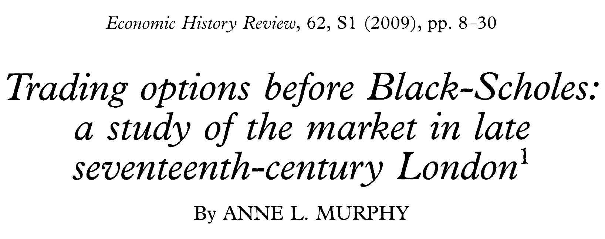
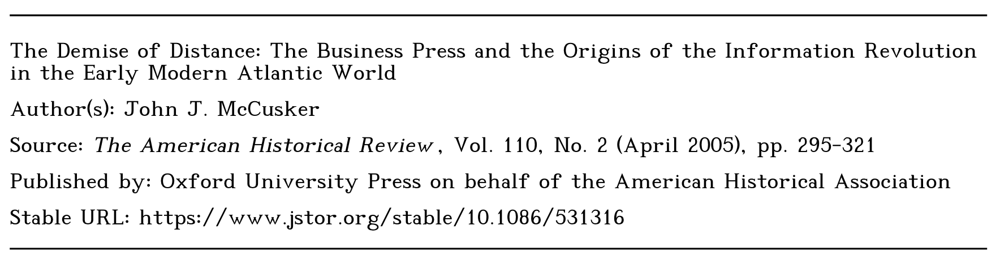
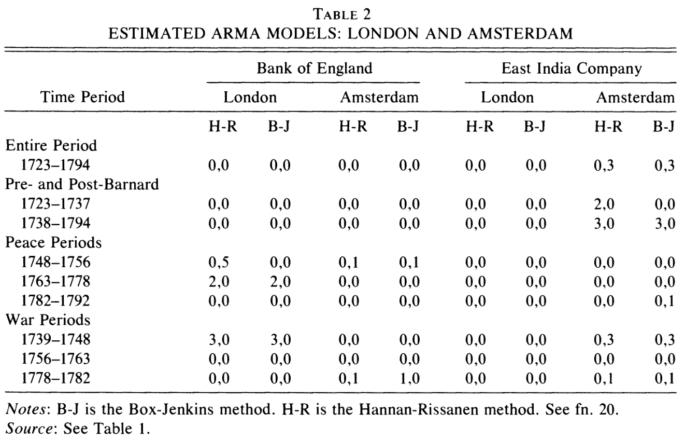
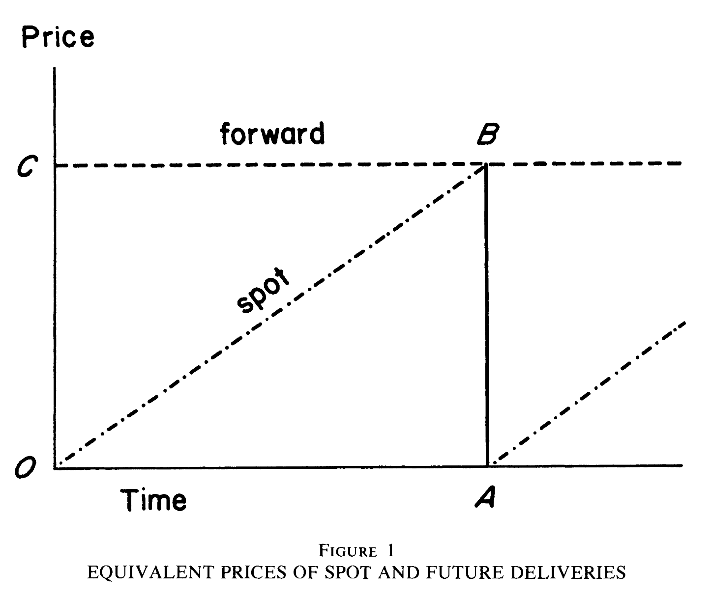
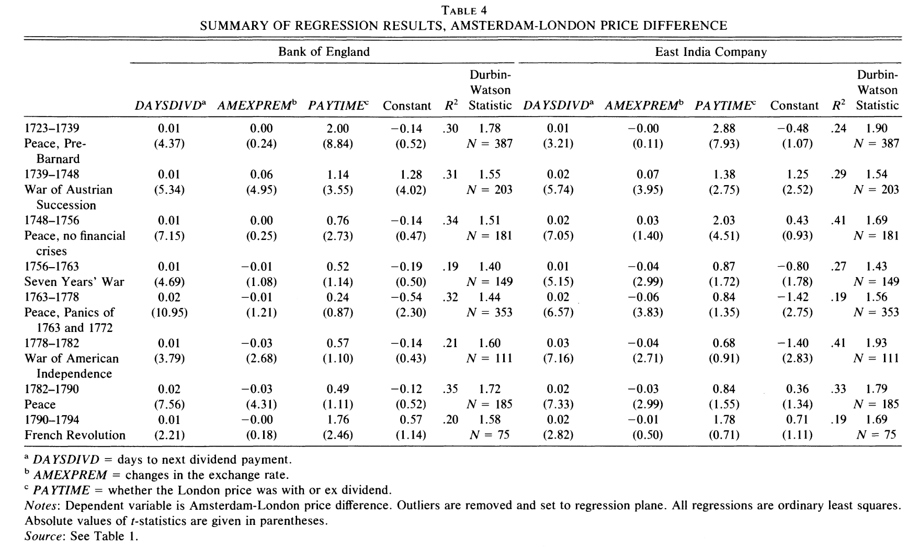
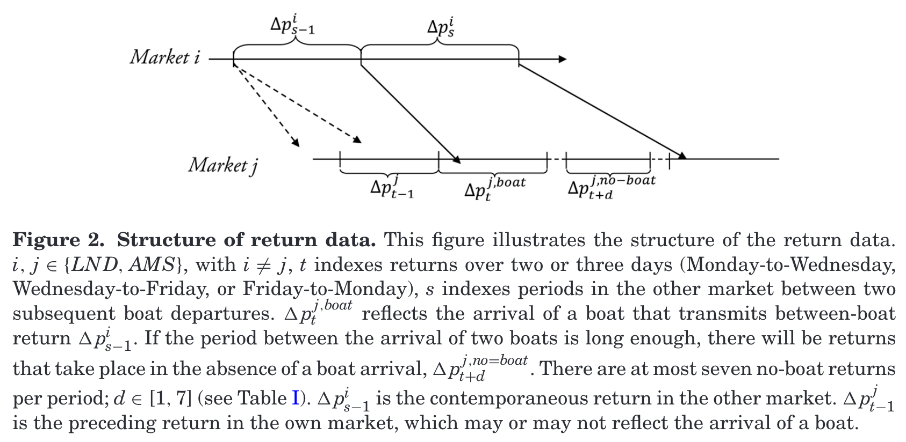
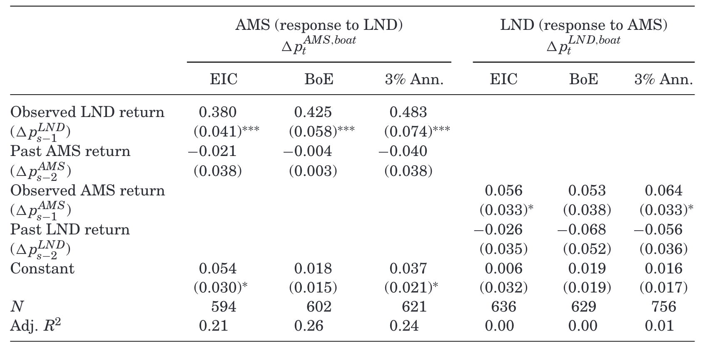

```{r setup, include=FALSE}
knitr::opts_chunk$set(echo = FALSE, warning = FALSE,
                      message = FALSE, fig.align='center', fig.retina=3,
                      out.width="75%")

```

```{r xaringan-themer, include = FALSE}
library(xaringanthemer)
style_solarized_light()
source("helper_functions/theme_lecture.R")
xaringanExtra::use_webcam()
xaringanExtra::use_tile_view()
```

## Introduction

.pull-left[
+ About me
+ About this course in the 2nd semester
  - What we will cover
  - Some questions for you
+ About today's lecture
  - Situating the topic
  - Situating my approach
]

.pull-right[
--------------------------
.Large[**Office Hours**:]
+ Tuesday 11am (S8.23) & Wednesday 11am (Teams)
+ Contact: gabriel.mesevage@kcl.ac.uk
--------------------------
]

---

## Situating this topic

+ Moving into a period of more data-rich economic history
  - Data availability has drawn more cliometricians 
    + Neal on 18th century joint-stock companies: "Little evidence remains ... save for the prices of the shares, but they exist in great quantity" (Neal 1987, 97).
  - Increased interest in *testing economic theory* in addition to *explaining what happened*
  
+ Integration, connections, arbitrage
  - We are focusing today in particular on integration and connections between London and Amsterdam
  - Foreshadows many 19th and 20th c. topics
  
---

## Some historical background

+ Glorious Revolution (1688)
+ Company promotion book of the 1690s 
  - "between 1688 and 1695 around 100 new English joint-stock companies were established, offering investment opportunities in projects as fanciful as the quest to recover sunken treasure ships and as practical as the manufacture of linen, paper, and glass" (Murphy 2015, 9).
+ High-skilled refugee flows to Britain
  
> "The initial impetus for the spread of these particular innovations derived from the wars and the underlying religious conflicts that led to mass migrations and countermigrations of religious minorities. The forced displacement of merchant elites began with the expulsion of the **Sephardic Jews from Granada in 1492** by Ferdinand and Isabella. It continued in the sixteenth century with the persecution of **Ashkenazic Jews in central Europe, as well as the emerging Protestant groups**, and culminated in the seventeenth century. In that century, the flight of refugee elites began with the Spanish expulsion of the **Moors from Valencia**, spread through central Europe with the Thirty Years' War, and climaxed in the 1680s with the expulsion of the Huguenots from France,18 the importation of Dutch Jewish communities and other religious dissidents into England with William III, and the "flight of the wild geese" from Ireland (which included Richard Cantillon)" (Neal 1990, p. 10)

---

## What was traded?

.pull-left[
### East India Company

+ Trading company, large possessions in India (eventually becomes essentially a state in India)
+ Fortunes very contingent on British politics

### South Sea Company

+ For most of this period mostly engaged in helping to finance British government debt
+ Famously a bubble in 1720s, part of elaborate financial engineering around public debt/equity swap
]

.pull-right[
### Bank of England

+ Emerges out of post 1688 settlement
+ At this point a *private* bank with some monopoly privileges in UK
  - Also political risk around monopoly renewals

### Annuities

+ British government debt (Consols, from consolidated anuities)
]

---

.pull-left[
### How was it traded?

### Market structure
]

.pull-right[
### Instruments


+ How were these priced in the era before Black-Scholes?
  - Show some 'modern' properties like option price rising with time, rising as more 'in the money' and rising with volatility
  
> "The evidence presented above depicts a market that was orderly and effective, and in which value was derived using criteria that were consistent and clearly agreed upon by the majority of participants" (Murphy 2009, 26).
]

---

.pull-left[
## What are our sources?

### Price lists

+ John Castaing's *Course of the Exchange*

### Business press


+ Dutch newspapers and 'price currants'
+ Printing press is critical in accurate dissemination of price data and business newspapers grow significantly in this period.
]

.pull-right[

]
---

class: center, middle, inverse

## Studying integration

> "In the early eighteenth century a special form of economic integration occurred between the two leading mercantile cities of Europe, Amsterdam and London. An international capital market developed which led to ever wider-ranging capital markets for each center over the succeeding centuries. It may also have facilitated the progress of economic integration for northwestern Europe in terms of markets in goods and labor. This early capital market, however, seems to have been largely overlooked in the more recent historical, as well as in the economic, literature. My article lays the basis for a greater appreciation of its role in the rise of early capitalism by **explaining its operation in theoretical terms** and **analyzing its results in quantitative terms**" (Neal 1987, 95).

---

.pull-left[

### Neal's starting point

> "I make a start by searching for evidence that either of the markets for English securitiesthe Amsterdam or the London stock exchange-was less than efficient in setting prices" (Neal 1987, 102).
]

.pull-right[
### Why start by testing if returns are predictable?

> "If some combination of autoregressive and moving average processes yield consistently good descriptions of price changes, then presumably interested speculators could have discovered these processes and used them to make profits in the markets" (Neal 1987, 103).

]

### Predictability and the Efficient Markets Hypothesis

+ Is this assuming traders are 'rational'?
  - Not necessarily, although if they were prices should be 'unforcastable'
  - Question being asked is 'are markets incorporating information'
+ But also:
  - Can have irrational but uncorrelated traders
  - Can have irrational traders who get selected out

---

class: inverse, center, middle

## EMH and 'making money'

> "…'making money' in finance means making a superior return **after an adjustment for risk**. Showing that a particular strategy based on exploiting stale information on average earns a positive cash flow over some period of time is not, therefore, by itself evidence of market inefficiency. To earn this profit, an investor may have to bear risk and his profit may just be a fair market compensation for risk-bearing" (Shleifer 2000, 5).

---

## Neal's approach

### What is an ARMA(p,q)?

.Large[
$y_t = c + \epsilon_{t} + \sum_{i=1}^p \phi_i y_{t-i} + \sum_{i=1}^q \theta_i \epsilon_{t-i}$
]

### Simplified example ARMA(1,0)

+ imagine $y_t$ is the % return on a stock

.Large[
$y_t = c + \phi y_{t-1} + \epsilon_t$
]

+ If $\phi \neq 0$ can look at today's return and *on average* predict next period's return

---

## Neal's approach: data

+ 3 stocks: BoE, EIC, and SSC
+ Collects British data from *Course of the Exchange*
  - Available series begins 1697
+ Uses data from Van Dillen drawn from *Amsterdamsche Courant*
  - Begins 1723
  - Prices every two weeks
  - 1676 joint observations (matched prices in London and Amsterdam)

---

## Neal's approach: findings

.center[

]

---

## Neal's approach: explaining anomalies

.left-column[
+ Spot vs future prices can account for price predictability
]

.right-column[
.center[

]]

---

### Does this explain differences in prices?

.center[

]

---

## What do we learn?

.Large[
+ Is this a good test of *efficiency*?
]

.Large[
+ Is this a good test of integration?
]

---

class: inverse, center, middle 

## What does the period tell us about financial markets?

> "The purpose of this paper is to shed more light on what drives short-term asset price movements. Specifically, it uses a **natural experiment** where information flows are easily observable and where, **for exogenous reasons**, the market is starved from news for days in a row. The paper aims to (1) identify how much markets move in the presence and absence of news and (2) to explain asset price movements that are unrelated to the arrival of new information. **The natural experiment is provided by the Amsterdam market for English securities in the 18th century**" (Koudijs 2016, 1186).

.Large[
*The past as a laboratory*
]

---

## Boats and decomposing return variance

.pull-left[

> (1) the arrival of public news and (2) the impact of the trading process, which can capture privately informed trading, liquidity trades or shifts in investor sentiment (Koudijs 2016, p. 1185).
]

.pull-right[
### Sources of variance

1. Public news
2. The trading process
  1. private information 
  2. liquidity trades
  3. investor sentiment
]

---

## Koudijs data

---

class: center, middle

## What is the *mechanism*?

.center[

]

---

## What are the *identifying assumptions*?

---

## The impact of boat arrivals: specification

---

class: center, middle

## The impact of boat arrivals: results



---

## What about when a boat doesn't arrive?

+ Give categories
+ Skip for reasons of time

---

## Reflections on learning from Koudijs

+ What is the question of *external validity*?
+ Does it tell us things about how *efficient* the AMS market was (Neal's goal)?

---

## Some broad thoughts on testing market efficiency in the past

+ What is the alternative model?


  