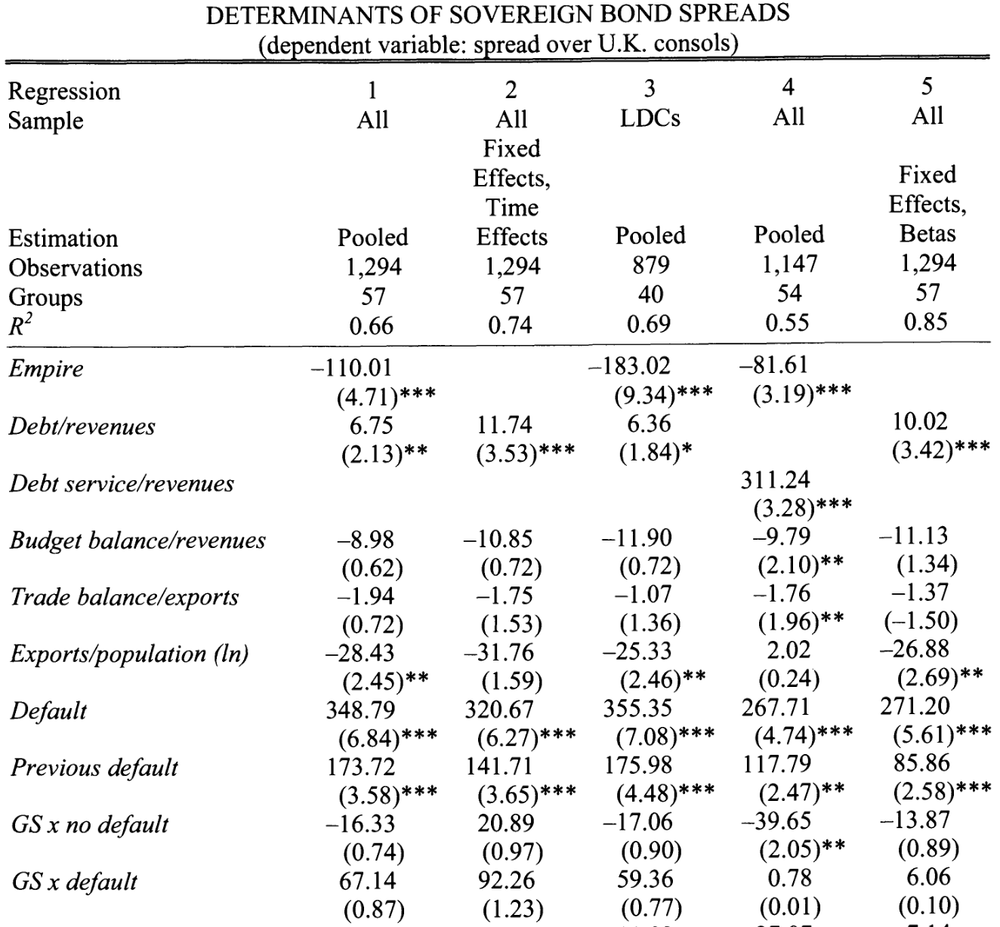
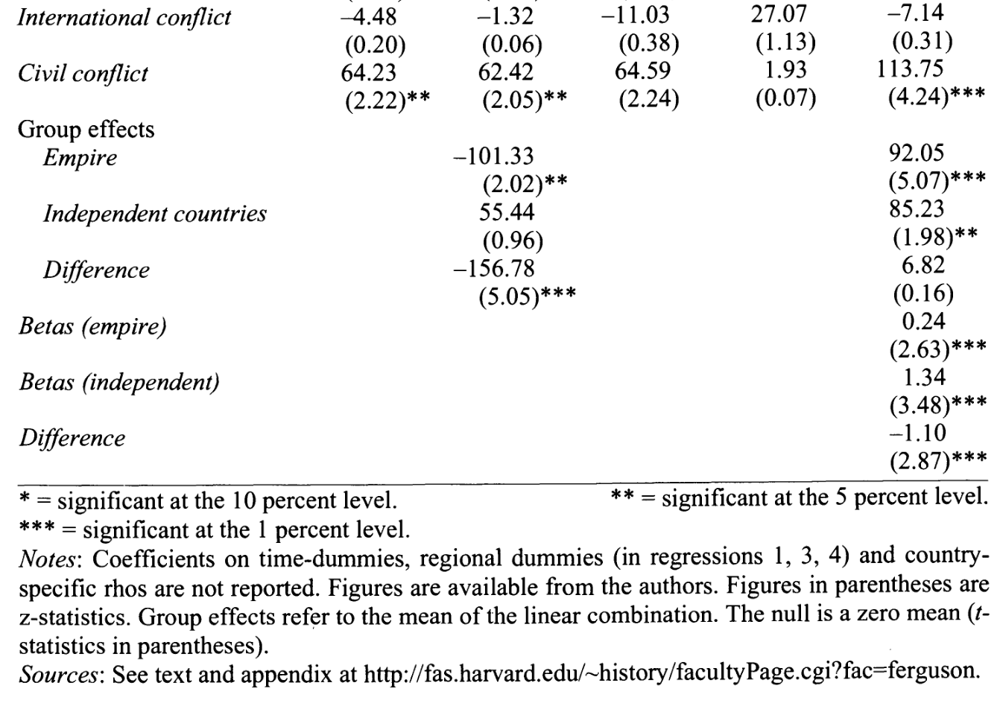
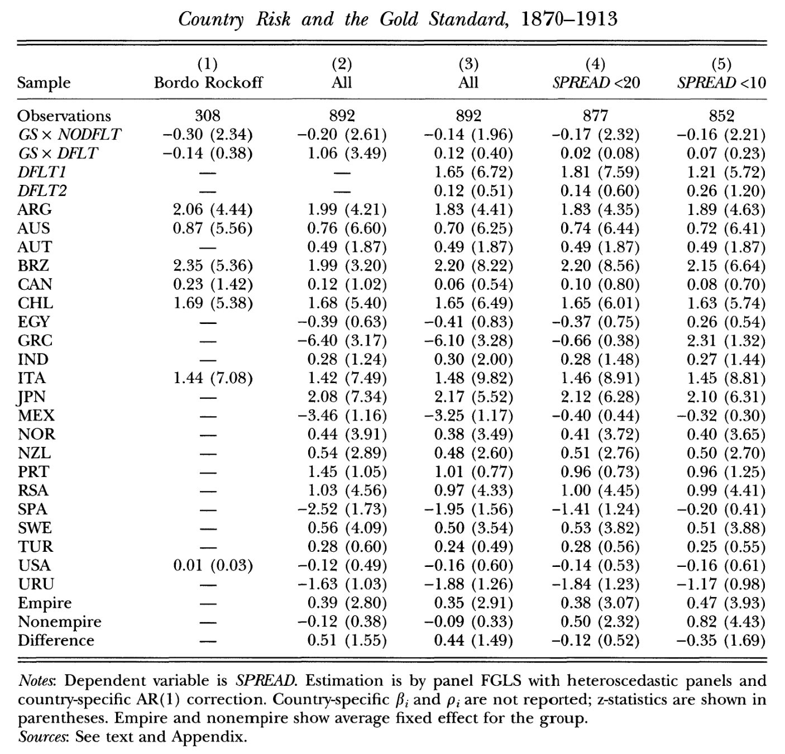
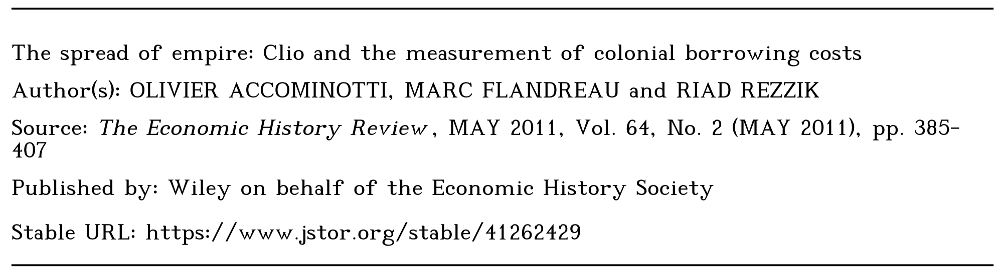
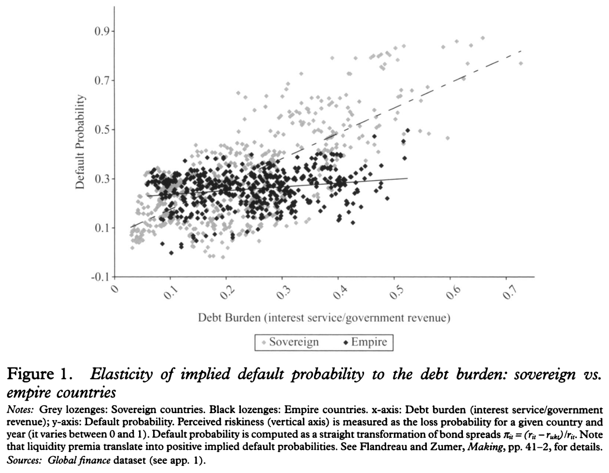
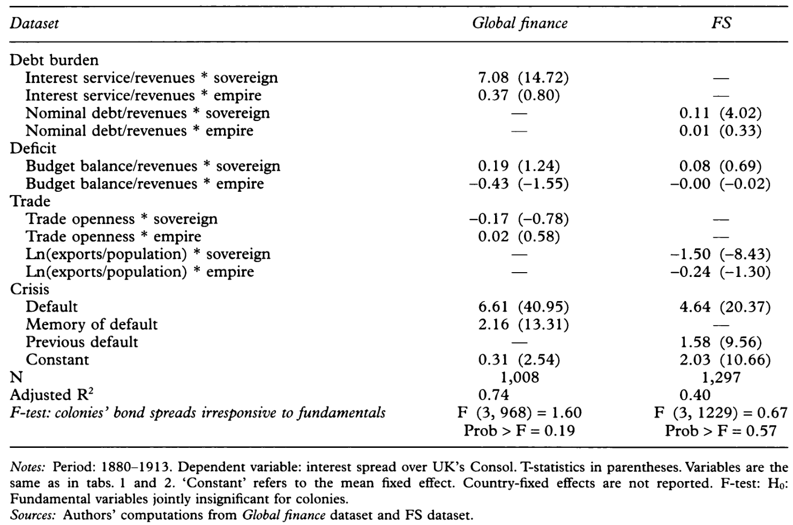

```{r setup, include=FALSE}
knitr::opts_chunk$set(echo = FALSE, warning = FALSE,
                      message = FALSE, fig.align='center', fig.retina=3,
                      out.width="75%")

```

```{r xaringan-themer, include = FALSE}
library(xaringanthemer)
style_solarized_light()
source("helper_functions/theme_lecture.R")
xaringanExtra::use_webcam()
xaringanExtra::use_tile_view()
```


## Introduction

.Large[### Today's Plan

+ Colonialism and Sovereign Debt: framing the problem
  + The return to institutions
  + Measuring institutions
  + Institutions in cross-country regressions
+ Colonialism and sovereign debt reconsidered
  + Accominotti et al
  + Gardner
]

---

## Colonies, Institutions and Growth

+ A resurgent literature on institutions and growth since the 1990s/200s
  - Key contributions by Acemoglu et al take colonies as a source of variation in institutional form
  - Disease burden $\rightarrow$ type of colony $\rightarrow$ type of institution $\rightarrow$ growth
  
+ Led to broader study of *effects of colonialism* on growth
  - Obstfeld & Taylor (2003): Empire itself does little, gold standard is what matters
  - Ferguson and Schularick (2006): Empire lowers borrowing costs

### Is this a 'benefit' of empire?

> "apologists for Europe's imperial record over this period" <br> - (O'Brien 2006)

---

## An older literature on costs of empire

.pull-left40[
#### Davis and Huttenback, *Mammon and the Pursuit of Empire*


]

.pull-right60[
+ The strong case for the economic irrationality of empire
    - Compute costs and revenues
    - Revenues go to narrow elite
    - Costs fall on the public
        + costs of defence, administration, infrastructure, opportunity costs
    - 'Winners' are specific elites and settler colony emigres
    - 'Losers' are the British taxpayer and (obviously) the colonized
    
> "... if I invest either in the public funds or in some private industrial venture in a foreign country for the benefit of my private purse, getting specially favorable terms to cover risks arising from the political insecurity of the country or the deficiencies of its Government, I am entitled to call upon my Government to use its political and military force to secure those very risks which I have already discounted in the terms of my investment. Can anything be more palpably unfair?" <br> —Hobson, 1902, p. 358.
]

---

## Empire's winners and losers

.center.Large[

> "The technology of the imperial machine ... involved some transfer of resources to the colonies; however, it is not obvious that either India or **the dependent colonies** [Ceylon, Jamaica, etc.] would have chosen to accept the imperial subsidy had they been given the opportunity to object ... **The colonies with responsible government** [Canada, Australia...] were clear winners; India and the dependent Empire, probably, were losers. ... The value of those benefits was high in the colonies of white settlement ... For the remainder of the Empire, the returns are less obvious ... For India and the dependent colonies one cannot rule out the conclusion that everyone (Briton and Indian) lost – a true Pareto pessimum." <br> - Davis and Huttenback quoted in Accominatti et al. 2009 fn. 5.

]

---

## The econometrics of empire

+ How to measure the average impact of empire on borrowing costs?

$Spread_{ct} = \beta_1 Int_{ct} + \beta_2 Budg_{ct} + \beta_3 Trade + \beta_4 Default_{ct} + \beta_5 Prev.Default_{ct} + C_c + T_t + \epsilon_{ct}$

+ $Spread_{ct}$ is the difference between the bond yield of country $c$ and UK consols at time $t$
  - consols are here considered the 'risk-free rate'. The Spread will in general always be positive as everyone pays more to borrow than UK gov
+ The parameters $C_c$ are the average increase/decrease in borrowing costs associated with each country $c$
  - If $C_c$ is **negative** then Spreads are lower for country $c$
  
.pull-left[
#### Testing for the empire effect

+ Countries fall in two groups $C_c \in \{Colony, Sovereign\}$
+ If $\bar{C}_{Colony} < \bar{C}_{Sovereign}$ where $\bar{X}$ means the average of $X$ than on average colonies borrow at lower rates
  - Why not include a variable for colony?
  
]

.pull-right[
|Country | Year | Colony
|-------------------------
|India | 1900 | 1
|India | 1901 | 1
| ... | ... | ...
|France | 1900 | 0
|France | 1900 | 0
  ]

---

## The econometrics of empire

.pull-left[

]

.pull-right[


+ Ferguson & Schularick, p. 299 table 3.
+ Colonies borrow ~1.5% cheaper than sovereigns!
]

---

.pull-left[
## The econometrics of empire

### But the result is unstable!

+ Obstfeld & Taylor ran a similar regression and got a different result
+ Ferguson and Schularick suggest their sample is larger
  - But many reasons for unstable result, most of them frustrating:
    + Measurement error, omitted-variable bias, **mispecification**...

]

.pull-right[

]

---

## How did investors think about country risk?



+ Argue most of the econometric approaches have been **mispecified** because the pricing model is different for **colonies** versus **sovereigns**.
+ **sovereigns** have a probability of default that sharply increases as their revenues fall, trade falls, etc.
+ But **colonies** are implicitly/explicitly guaranteed by colonizer. They don't have the **same** kind of default risk. Spreads represent some little risks of default + other issues like liquidity

---

.left-column[
## Example

+ Colonies less sensitive to debt burden than sovereigns
+ Logic is that we should run 2 seperate regressions

]

.right-column[
.center.middle[

]]

---

## The econometrics of empire re-specified

+ Need to think in terms of seperate relationships between spreads and 'fundamentals' for colonies and non-colonies

.pull-left[
+ 1 equation for colonies

$Spread_{ct}^{COL} = \beta_1^{COL} Int_{ct} + \beta_2^{COL} Budg_{ct} + \\ \beta_3^{COL} Trade + \beta_4^{COL} Default_{ct} +\\ \beta_5^{COL} Prev.Default_{ct} + C_c^{COL} + T_t^{COL} + u_{ct}$

+ And a seperate equation for sovereigns

$Spread_{ct}^{SOV} = \beta_1^{SOV} Int_{ct} + \beta_2^{SOV} Budg_{ct} +\\ \beta_3^{SOV} Trade + \beta_4^{SOV} Default_{ct} +\\ \beta_5^{SOV} Prev.Default_{ct} + C_c^{SOV} + T_t^{SOV} + v_{ct}$

]

.pull-left[

]

---

## Econometrics and interpretations

.pull-left[

> "The Empire made the spread paid by subject countries insensitive to their performance because credibility was decided elsewhere. You would not look in India for indications of India's credit. More likely, you would look at Downing Street. The effect of empire was not to provide subjects with a marginal interest rate benefit but to remove the default risk altogether" <br> - Accominotti et al. p. 399
]