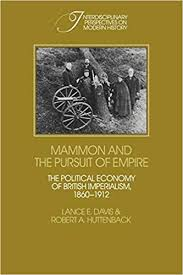

```{r setup, include=FALSE}
knitr::opts_chunk$set(echo = FALSE, warning = FALSE,
                      message = FALSE, fig.align='center', fig.retina=3,
                      out.width="75%")

```

```{r xaringan-themer, include = FALSE}
library(xaringanthemer)
style_solarized_light()
source("helper_functions/theme_lecture.R")
xaringanExtra::use_webcam()
xaringanExtra::use_tile_view()
```


## Introduction

.Large[### Today's Plan

+ Colonialism and Sovereign Debt: framing the problem
  + The return to institutions
  + Measuring institutions
  + Institutions in cross-country regressions
+ Colonialism and sovereign debt reconsidered
  + Accominotti et al
  + Gardner
]

---

## Colonies, Institutions and Growth

+ A resurgent literature on institutions and growth since the 1990s/200s
  - Key contributions by Acemoglu et al take colonies as a source of variation in institutional form
  - Disease burden $\rightarrow$ type of colony $\rightarrow$ type of institution $\rightarrow$ growth
  
+ Led to broader study of *effects of colonialism* on growth
  - Obstfeld & Taylor (2003): Empire itself does little, gold standard is what matters
  - Ferguson and Schularick (2006): Empire lowers borrowing costs

### Is this a 'benefit' of empire?

> "apologists for Europe's imperial record over this period" <br> - (O'Brien 2006)

---

## An older literature on costs of empire

.pull-left40[
#### Davis and Huttenback, *Mammon and the Pursuit of Empire*


]

.pull-right60[
+ The strong case for the economic irrationality of empire
    - Compute costs and revenues
    - Revenues go to narrow elite
    - Costs fall on the public
        + costs of defence, administration, infrastructure, opportunity costs
    - 'Winners' are specific elites and settler colony emigres
    - 'Losers' are the British taxpayer and (obviously) the colonized
    
> "... if I invest either in the public funds or in some private industrial venture in a foreign country for the benefit of my private purse, getting specially favorable terms to cover risks arising from the political insecurity of the country or the deficiencies of its Government, I am entitled to call upon my Government to use its political and military force to secure those very risks which I have already discounted in the terms of my investment. Can anything be more palpably unfair?" <br> —Hobson, 1902, p. 358.
]

---

## Empire's winners and losers

.center.Large[

> "The technology of the imperial machine ... involved some transfer of resources to the colonies; however, it is not obvious that either India or **the dependent colonies** [Ceylon, Jamaica, etc.] would have chosen to accept the imperial subsidy had they been given the opportunity to object ... **The colonies with responsible government** [Canada, Australia...] were clear winners; India and the dependent Empire, probably, were losers. ... The value of those benefits was high in the colonies of white settlement ... For the remainder of the Empire, the returns are less obvious ... For India and the dependent colonies one cannot rule out the conclusion that everyone (Briton and Indian) lost – a true Pareto pessimum." <br> - Davis and Huttenback quoted in Accominatti et al. 2009 fn. 5.

]

---

## The econometrics of empire

+ How to measure the average impact of empire on borrowing costs?

$$
Spread_{ct} = \alpha + \beta_1 Int/rev_{ct} + \beta_2 BudgBal/rev_{ct} + \beta_3 ln(Ex./pop) + Default_{ct} + Prev.Default_{ct} + C_c + T_t + \epsilon_{ct}
$$
+ The dummy variable parameters $C_c$ are the increase/decrease in borrowing costs associated with each country $c$
+ They fall in two groups $C_c \in \{Colony, Sovereign\}$
+ Test whether $\bar{C}_{Colony} < \bar{C}_{Sovereign}$ where $\bar{X}$ means the average of $X$.

