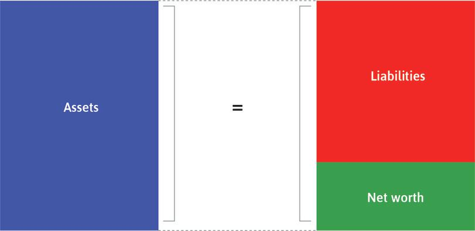
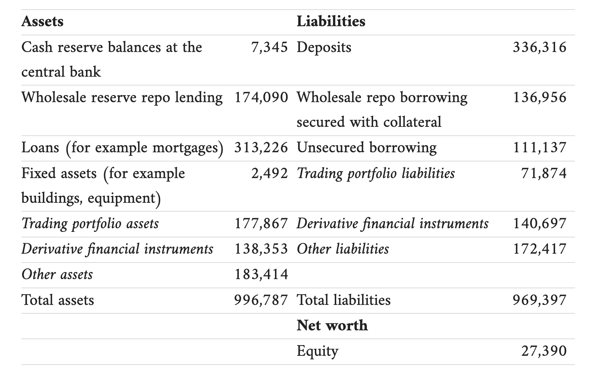
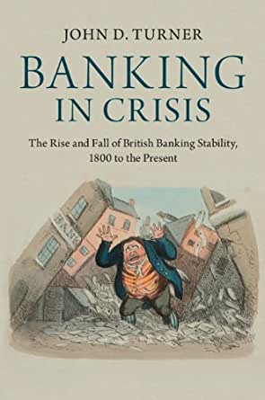

```{r setup, include=FALSE}
knitr::opts_chunk$set(echo = FALSE, warning = FALSE,
                      message = FALSE, fig.align='center', fig.retina=3,
                      out.width="75%")

```

```{r xaringan-themer, include = FALSE}
library(xaringanthemer)
style_solarized_light()
source("helper_functions/theme_lecture.R")
xaringanExtra::use_webcam()
xaringanExtra::use_tile_view()
```


## Introduction

.Large[

### Today's Plan

+ Banks in theory
  + Balance sheet structure
  + Sources of instability
  + Solutions
+ Comparative banking systems
  + Gerschenkron
  + Political accounts
    - US banking in the 19th century
]

---

# What is a Bank?

.center[

]

---

### Leverage: Barclay's Simplified Balance Sheet, 2006

.center[

]

+ Leverage ratio $= 996,787/ 27,390 = 36.4$

---

## Leverage, Risk and Liability: Why do banks fail?

.pull-left[
### Liability-side risks

.large[
+ Runs on deposits
    - Deposits can be withdrawn at will
    - First-come-first-served
+ Can spook creditors
+ Can spark fire-sales
    - Asset-side deterioration
]
]

.pull-right[
.large[
### Asset-side risks

+ Investments also go down!
    - Economy-wide shocks (e.g. US Civil War and 'cotton famine')
    - If Barclay's assets (in 2006) declined by > 2.7% the bank is technically insolvant (net worth is negative)!


]]

---

---

## Illiquidity vs Insolvency

.large[
.pull-left[
### Insolvency

+ Liabilities exceed assets

### Illiquidity -> Insolvency?

+ If you need to sell in a hurry the value of your assets can decline
    - Often what begins as a 'liquidity' crisis can come to look like 'insolvency'
    
]

.pull-right[
### Illiquidity

+ Short-run demand for cash exceeds supply
+ Assets exceed liabilities but not all held as cash
+ **It can be rational to run a bank even if you don't think it's insolvent!**
]


]

---

## Leverage, Risk and Liability: Why do banks fail?

.pull-left[
### Why take on so much risk?

.large[
+ Why take on so much leverage?
    - Why do companies get bigger?
+ What happens in the case of failure?
    - Limited liability, double liability, unlimited liability
+ Seperation of ownership and control (agency problems)
]
]

.pull-right[
### Why do depositors allow it?

.large[
+ Very hard to monitor
    - I give you a list of 100s of investments (bonds, stocks, land, water, gold, wine, art, etc.) and ask how much its worth. How accurate can you be?
    - Exact asset positions not public
]
]

<br>

.Large[**Why not have banks hold 100% deposits in reserves?**]

---

## Leverage, Risk and Liability: solutions?

.pull-left40[

]

.pull-right60[
.large[

### Turner Suggests 2:

1. Extended liability
    - Unlikely to 'risk shift' if entire net-worth on the line
    - City of Glasgow failure
      - 100 share $\rightarrow$ 2,750 liability. 85% of shareholders insolvent.

2. Regulation/Government Supervision
]]


---


```{r bankgraph, out.width='80%', fig.height=4.5, fig.width=6, fig.retina=4}
library(ggrepel)
library(tidyverse)

bdata <- data.frame(type = rep(c("State-chartered bank", 
                                 "Unlimited-liability JS",
                             "Limited-liability JS"), each = 7),
                    date = rep(c(1826, 1830, 1839, 1849, 1869, 1889, 1899),
                               3),
                    number = c(rep(1, 7), 3, 14, 117, 113, 73, 2, 0,
                               0,0,0,0,41,102,81))

bdata %>% filter(type != "State-chartered bank") %>% 
  ggplot(aes(date, number, 
             color = type,
             label = number)) + 
  geom_point(size=3) + 
  geom_label_repel() +
  geom_line() +
  theme_hc() +
  scale_color_hc() +
  theme_lecture +
  xlab("") +
  ylab("Number of Banks in England") +
  ggtitle("The Growth of Limited-Liability Banking in the UK")
```

---

## The comparative origins of banking systems

.pull-left[

### Economic explanations

+ Gerschenkron and 'Economic Backwardness in Historical Perspective'

]

.pull-right[

### Political explanations

+ Varied. We will focus on Calomiris and Haber

]

****

.pull-left[
### Demand-side accounts

+ Focus on the *assets* side of the balance sheet 
  - Demand for lending
  - Profitable lending projects, etc.
]

.pull-right[
### Supply-side accounts

+ Focus on the *liabilities* side of the balance sheet
  - The pool of deposits/share of deposits in funding
]

---

## Alexander Gerschenkron

.pull-left60[

+ Expert on Soviet Economy
+ Taught history/economics at Harvard in the 1940s
+ Published in history/statistics

### Core ideas

+ Explaining developmental 'paths' among late-industrializers
  - Era of 'stages' of growth (Rostow, Marx, etc.)
+ Features
  - More capital good intensive
  - Buy the newest machinery
  - Faster industrial growth
  - **More coordination by government and banks**

]

.pull-right40[
.center[

]]

---

## Gerschenkron's distinction: segmented vs universal banking systems

> "The difference between banks of the credit-mobilier type and commercial banks in the advanced industrial country of the time (England) was absolute. Between the English bank essentially designed to serve as a source of short-term capital and a bank designed to finance the long-run investment needs of the eocnomy there was a complete gulf. The German banks, which may be taken as a paragon of the type of the universal bank, succesfully combined the basic idea of the credit mobilier with the short-term activities of commercial banks" <br> &mdash;(*Economic backwardness*, p. 13)

.pull-left[
### Universal

+ No separation of commercial and investment function
+ Deposit taking *and* investment
+ More of an 'ideal type'
]

.pull-right[

### Segmented

+ Lots of ways to segment!
+ Typically mean deposit-taking/commercial vs investment
]

---

### Gerschenkron's account

.pull-left[

### Early industrialization

> "The industrialization of England had proceeded without any substantial utilization of banking for long-term investment purposes. The more gradual character of teh industiralization process and the more considerable accumulation of capital, first from earnings in trade and modernized agriculture and later from industry itself, obviated the pressure for developing any special institutional devices for provision of long-term capital to industry" <br> &mdash;(p. 14)
]

.pull-right[

### Late industrialization

> "By contrast, in a relatively backward country capital is scarce and diffused, the distrust of industrial activities is considerable, and, finally, there is greater pressure for bigness because of teh scope of teh industrialization movement, the larger average size of plant, and the concentration of industrialization processes on branches of relatively high ratios of capital to output. To these should be added the scarcity of entrepreneurial talent in the backward country." <br> &mdash;(p. 14)
]

---

## Consequences of Gerschenkron's model

> "Germany thus had derived full advantages from being a relatively late arrival in the field of industrial development... **But, as a result, German industrial economy, because of specific methods used in the catching-up process, developed along lines not insignificantly different from those in England**" <br> &mdash;(p. 16)

+ Germany focuses on heavy industry (capital intensive) rather than light
+ Greater process of amalgamation
  - "The banks refused to tolerate fratricidal struggles among their children"
  - Larger average plant size
  
---

## Political origins of comparative financial development?

.pull-left[
.Large[
Gerschenkron argues for a set of **incentives** that compensate banks for overcoming **impediments** to growth.

A predominantly **economic** explanation.
]
]

.pull-right[

.Large[
But banks are **highly-regulated** institutions that depend on particular legal-institutional forms: **deposit-insurance**, **liability**, **incorporation**, **lender-of-last-resort**, etc.

Is this bank-politics nexus necessary or historically contingent?
]
]

---

## The political origins of banking systems: Calomiris and Haber

.pull-left[

+ link between banking and politics **inevitable**
+ All banking systems represent a political settlement
+ Perspective is heavily influenced by **public choice**

]

.pull-right[

> "Our goal is... to provide an understanding of two crucial issues: why there are no banking systems without the active participation of governments, and why no government can be a completely neurtral arbiter when it comes to the banking system. In short, our goal is to explore why banking is all about politics -- and always has been. <br>&mdash;Calomiris & Haber, p. 28-29.
]

---

## Three property rights problems

.pull-left.Large[
1. Mechanisms to prevent government expropriation
2. Minority shareholders/depositors need mechanisms to prevent expropriation
3. Mechanisms to stop borrowers from expropriating lenders
]

.pull-right[

> "The implication is inescapable: the property-rights system that structures banking has not evolved in response to some efficiency criterion in an anonymous "market" for institutions. Rather it is the product of deals arranged and enforced within an existing set of political institutions and hammered out by coalitions of market participants and the group in control of government" <br> &mdash;Calomiris & Haber p. 38

]
---

## The 'Game of Bank Bargains': early American examples

.pull-left[
### US banking up to 1830ish

+ **States** grant limited charters
  - Bank investors get monopoly protection
  - **States** get equity in the bank, usually financed with a long **from** the bank
  - circa. 1810-30 bank dividends/charter fees as much as 1/3 of state revenue!
  - Don't allow branching so state captures full rent
  - **Losers**
    - Local borrowers pay monopoly rates
    - Local depositors earn monopsony rates
]

.pull-right[

### US banking post-1830ish

+ "Free" banking:
  - Banks can open without charter
  - Pushed by more 'populist' political coalitions
    + Redistributing rents from bankers to borrowers
  - **States** get loans: newly created banks have to hold state-debt to guarantee their note issues
  - Still don't allow branching so smaller local monopolies
+ **Costs**
  - Unstable! Small, undiversified banks.
  - Attempts in North to develop private-order deposit insurance
]

---

## Political vs Economic explanations

.Large[
Are these accounts necessarily **incompatible**?

Gerschenkron's universal vs segmented systems may be exaggerated but seems to capture some broad tendencies.

Calomiris & Haber focus on political dimension is helpful, but overstates political as opposed to economic determinants? E.g. wherever limited-liability gets allowed this is **always** the bank-bargain that is chosen.
]
