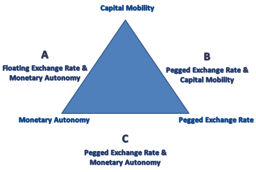

```{r setup, include=FALSE}
knitr::opts_chunk$set(echo = FALSE, warning = FALSE,
                      message = FALSE, fig.align='center', fig.retina=3,
                      out.width="75%")

```

```{r xaringan-themer, include = FALSE}
library(xaringanthemer)
style_solarized_light()
source("helper_functions/theme_lecture.R")
xaringanExtra::use_webcam()
xaringanExtra::use_tile_view()
```


## Introduction

.Large[

### Today's Plan

+ The Trilemma
+ Testing the trilemma
+ Transitioning out of the trilemma
+ Why was the gold standard stable?
+ Why did the gold standard collapse?

]

---

## Economic globalization over the long-term

.center.Large[
> "The characterization of economic globalization as a "golden straitjacket" evokes two distinct sets of questions. One can ask how golden the jacket is, or else how strait it is." <br> &mdash;Obstfeld, Shambaugh, Taylor (2005), p. 423

]

.Large[
+ **'Golden'**: the way constraints on economic policy from globalization impact growth
  - E.g. literature on effects of gold standard adherence
+ **'Strait'**: how binding are these constraints anyway?
]


---

.center[

]

---

## The Trilemma: historical monetary policy regimes

.pull-left[
.Large[
Can pick **two** out of:

1. Stable exchange rates
2. free capital mobility
3. and flexible domestic monetary policy,


]
]

.pull-right[

### Regimes

.Large[
1. Classical gold standard (1870s-1914): 1 & 2
2. Interwar gold standard (1918-1938): *here be dragons...*
3. Bretton woods (1950s-1973): 1 & 3
4. Current regime (1970s-present): mostly 2 & 3
]
]

---

## The trilemma: *testing* historical monetary policy regimes

.Large[

All the pieces are **hard to measure**.

1. Exchange rate stability is the easiest but still imperfect, e.g. if a currency is **officially** pegged, does it trade at the peg in **practice**?
2. Capital mobility is difficult to track.
3. How do we know if domestic monetary policy is being exercised 'flexibly'?
  + Obstfeld, Shambaugh, Taylor (2005) propose testing **short-run nominal interest rate deviations** from a global benchmark
  + What if domestic authorities 'flexibly' choose to follow the global benchmark?

]

---

## Testing the trilemma: Interest rates

.Large[
Call the short-term interest rate of country $i$ at time $t$ $R_{it}$ and the global baseline rate $R_{bt}$.

Not straight-forward to test the relationship between $R_{it}$ and $R_{bt}$: interest rates often have high **autocorrelation**. If interest rate levels tend to drift
in a given direction, this can lead to a case of **spurious regression** &mdash; a common problem when studying time series.]

***

.pull-right[
For more on spurious regression see:
+ Granger and Newbold, "Spurious regressions in econometrics", *Journal of Econometrics*, Vol. 2, No. 2, 1974.
]

---

## Testing the trilemma: Specifications

.Large[

Focus on relationship between **changes** in interest rates ( $\Delta$ is often used to symbolize a difference over time)

$\Delta R_{it} = \alpha + \beta \Delta R_{bit} + u_{it}$

Then consider relationship including an **error-correction term**. Intuition: if the levels of interest rates diverge, how does that effect changes in interest rates?

$\Delta R_{it} = \alpha + \beta \Delta R_{bit} + \theta (c + R_{i,t-1} - \gamma R_{bi,t-1}) + u_{it}$

]

---

## Results in differences

---

## Results with cointegration

---

## The trilemma in critical perspective

+ Rey on how its a dilemma
+ Issues of identifying 'constraints' vs 'common shocks'

---

## From the trilemma to the gold-standard

+ A system that adjusted domestic monetary policy rapidly to global conditions
+ British rates are rapidly followed, 
+ Room to maneuvre offered by gold-points/arbitrage costs

### How does it come apart?

+ Start with the related question why was pre-WWI GS seemingly stable

---

## Some major interpretations

+ Kindleberger, *hegemonic stability*
+ Eichengreen, *credibility & cooperation*

