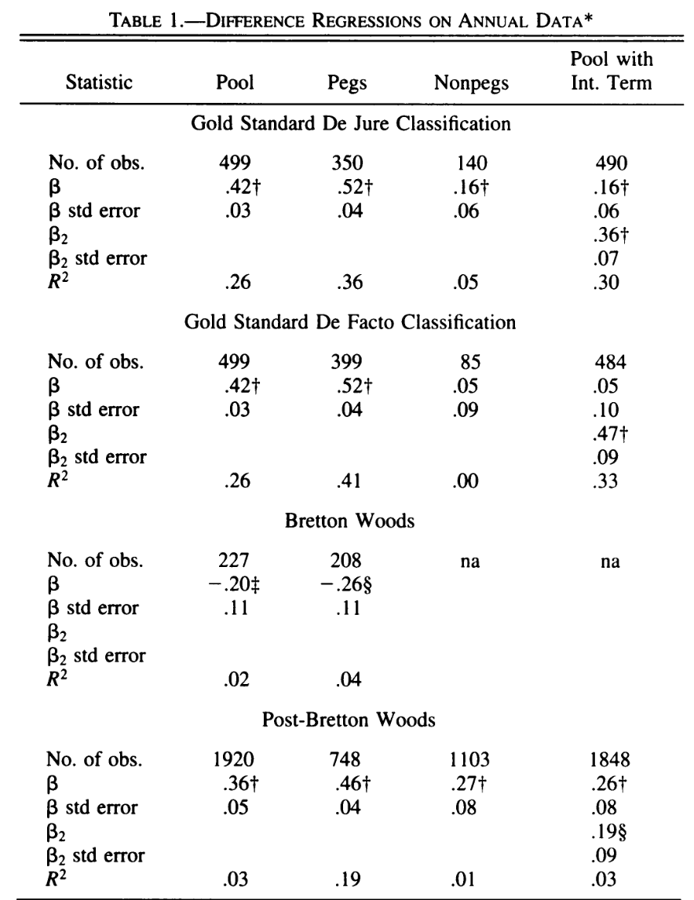
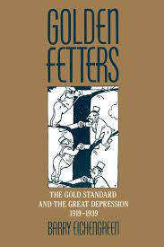

```{r setup, include=FALSE}
knitr::opts_chunk$set(echo = FALSE, warning = FALSE,
                      message = FALSE, fig.align='center', fig.retina=3,
                      out.width="75%")

```

```{r xaringan-themer, include = FALSE}
library(xaringanthemer)
style_solarized_light()
source("helper_functions/theme_lecture.R")
xaringanExtra::use_webcam()
xaringanExtra::use_tile_view()
```


## Introduction

.Large[

### Today's Plan

+ The Trilemma
+ Testing the trilemma
+ Transitioning out of the trilemma
+ Why was the gold standard stable?
+ Why did the gold standard collapse?

]

---

## Economic globalization over the long-term

.center.Large[
> "The characterization of economic globalization as a "golden straitjacket" evokes two distinct sets of questions. One can ask how golden the jacket is, or else how strait it is." <br> &mdash;Obstfeld, Shambaugh, Taylor (2005), p. 423

]

.Large[
+ **'Golden'**: the way constraints on economic policy from globalization impact growth
  - E.g. literature on effects of gold standard adherence
+ **'Strait'**: how binding are these constraints anyway?
]


---

.center[


**Examples?**
]

---

## The Trilemma: historical monetary policy regimes

.pull-left[
.Large[
Can pick **two** out of:

1. Stable exchange rates
2. free capital mobility
3. and flexible domestic monetary policy,


]
]

.pull-right[

### Regimes

.Large[
1. Classical gold standard (1870s-1914): 1 & 2
2. Interwar gold standard (1918-1938): *here be dragons...*
3. Bretton woods (1950s-1973): 1 & 3
4. Current regime (1970s-present): mostly 2 & 3
]
]

---

## The trilemma: *testing* historical monetary policy regimes

.Large[

All the pieces are **hard to measure**.

1. Exchange rate stability is the easiest but still imperfect, e.g. if a currency is **officially** pegged, does it trade at the peg in **practice**?
2. Capital mobility is difficult to track.
3. How do we know if domestic monetary policy is being exercised 'flexibly'?
  + Obstfeld, Shambaugh, Taylor (2005) propose testing **short-run nominal interest rate deviations** from a global benchmark
  + What if domestic authorities 'flexibly' choose to follow the global benchmark?

]

---

## Testing the trilemma: Interest rates

.Large[
Call the short-term interest rate of country $i$ at time $t$ $R_{it}$ and the global baseline rate $R_{bt}$.

Not straight-forward to test the relationship between $R_{it}$ and $R_{bt}$: interest rates often have high **autocorrelation**. If interest rate levels tend to drift
in a given direction, this can lead to a case of **spurious regression** &mdash; a common problem when studying time series.]

***

.pull-left[
+ Any two variables with a **time-trend** will appear correlated
  - E.g. annual measures since 1990 of my height and the number of times Nicholas Cage has been married
  - Not causal (I don't think!)
]
.pull-right[
For more on spurious regression see:
+ Granger and Newbold, "Spurious regressions in econometrics", *Journal of Econometrics*, Vol. 2, No. 2, 1974.
]

---

## Testing the trilemma: Specifications

.Large[

Focus on relationship between **changes** in interest rates ( $\Delta$ is often used to symbolize a difference over time)

$\Delta R_{it} = \alpha + \beta \Delta R_{bit} + u_{it}$

Then consider relationship including an **error-correction term**. If interest rates diverge how long does it take for them to come back together?

$\Delta R_{it} = \alpha + \beta \Delta R_{bit} + \theta (c + R_{i,t-1} - \gamma R_{bi,t-1}) + u_{it}$

If no arbitrage costs we predict $\beta = 1$. Practically, expect $\beta$ to be much lower even if still binding.

]

---

.pull-left[
## Results in differences

.Large[
+ Pegged currencies have $\beta$ coefficients that are larger
+ Gold standard and post-Bretton Woods have similar magnitude
  - **But**: under Gold Standard this explains a lot more of the variation in interest rates
+ Some evidence for *fear of floating*
]
]

.pull-right[

]

---

## Results with cointegration

.right-column[
```{r, fig.align='center', fig.retina=4, fig.height=4, fig.width=6, out.width="90%"}
library(tidyverse)

df <- tibble(regime = c("1870-1914: Gold Standard", "1870-1914: Gold Standard", 
                             "1945-1973: Bretton Woods", 
                             "1973+: Post-Bretton Woods", "1973+: Post-Bretton Woods"),
             fixed = c("Peg", "Non-Peg", "Peg", "Peg", "Non-Peg"),
             theta = c(-.27, -.16, -.11, -.19, -.06),
             Halflife = c(4.79, 4.44, 9.28, 7.84, 35.16))

df |> 
  ggplot(aes(fixed, Halflife, fill = fixed)) + 
  geom_col() +
  facet_wrap(~regime) + 
  theme_lecture + 
  ylab("Number of months adjustment takes")

```
]

.left-column[
+ For the Gold Standard: 'gold points' (costs of arbitrage) plus tendency for British rate to mean-revert means you can partially adjust and wait
+ But adjustment is still **much faster** than other eras.]

---

## Why might adjustment be different under the gold standard?

> "What rendered the commitment to gold credible? In part, there was **little perception that policies required for external balance were inconsistent with domestic prosperity.** There was scant awareness that defense of the gold standard and the reduction of unemployment might be at odds." <br> &mdash;Eichengreen, p. 3

--

### Bringing the politics back in

> "The connection between domestic politics and international economics is at the center of this book. The gold standard, I argue, **must be analyzed as a political as well as an economic system**." <br> &mdash;Eichengreen, p. 7

---

## The political economy of the gold standard and its demise

.Large[
We have a **rapidly adjusting** international monetary system post-1880 that appears to be stable.

This system is 'paused' during WWI: in particular, during the war there are various **capital controls** including preventing the export of gold.

After WWI there are widespread efforts to return to the Gold Standard system: poor economic performance, Great Depression, destabilizing capital flows. What happened?
]

---

## The gold standard vs the interwar: some major interpretations

.pull-left[
#### Charles Kindleberger

+ **hegemonic stability theory**


]

.pull-right[
#### Barry Eichengreen

+ **credibility** and **cooperation**


]

---

## Hegemonic stability

> "...**the international economic and monetary system needs leadership**. A country that is prepared ... to set standards of conduct ... to take on an undue share of the burdens of the system, and in particular to **take on its support in adversity** by accepting its redundant commodities, maintaining a flow of investment capital, and discounting its paper. Britain performed this role in the century to 1913; the United States in the period after the Second World War.... It is the theme of this book that part of the reason for the length and most of the explanation for the depth of the world depression was the inability of the British to continue their role of underwriter to the system and the reluctance of the United States to take it on until 1936."<br> &mdash; Kindleberger, 1987, p. 11

Key British roles for the system per Kindleberger

1. "accepting its redundant commodities": counter-cyclical buyer
2. "maintaining a flow of investment capital": counter-cyclical global lender
3. "discounting its paper": provider of liquidity in extremis

---

## Credibility and cooperation

.pull-left[

### Credibility

> "If one of these central banks lost gold reserves and its exchange rate weakened, funds would flow in from abroad in anticipation of the capital gains investors in domestic assets would reap once the authorities adopted measures to stem reserve losses and strengthen the exchange rate. ... The very credibility of the official commitment to gold meant that this commitment was rarely tested." <br> &mdash;Eichengreen, p. 3

+ Strengthened by domestic political economy
]

.pull-right[

### Cooperation

+ If global credit conditions are too tight and you want to loosen, difficult for a bank to do so on its own
  - E.g. if France reduces interest rates, capital will flow out to London. 
+ Argues that **outside of crises** global banks played 'follow the leader' mimicing London
+ **During crises** there is formal and explicit cooperation
+ Concludes **not** a hegemon, a cooperative system that is collectively managed
]

---

## Credibility, Cooperation and Demise

.Large[

In Eichengreen's version after WWI gold-commitment is **much less credible** because of domestic political forces on monetary and fiscal policy.

**Cooperation became much harder** because of 

1. Domestic interest groups.
2. The international war debt disputes (reperations)
3. 'competing conceptual frameworks' shaped by uniquely bad monetary experiences during and after the war
  + E.g. anti-inflationary France vs more interventionist Britain
]