```{r setup, include=FALSE}
knitr::opts_chunk$set(echo = FALSE, warning = FALSE,
                      message = FALSE, fig.align='center', fig.retina=3,
                      out.width="75%")

```

```{r xaringan-themer, include = FALSE}
library(xaringanthemer)
style_solarized_light()
source("helper_functions/theme_lecture.R")
xaringanExtra::use_webcam()
xaringanExtra::use_tile_view()
```


## Introduction

.Large[

### Today's Plan

+ Inequality
+ The *effects* of inequality
+ Inequality and debt
+ An aside on the capital account and global imbalances
+ Imbalances, inequality and debt?

]

---

.left-column[
### The stylized facts on inequality: global income inequality 

Chancel et. al. *World Inequality Report* (2022)

+ Inequality *globally* rises across the 19th century
+ Falls in mid-20th and rises again
+ Measured as Top-10th/Bottom-50th
]

.right-column.center[
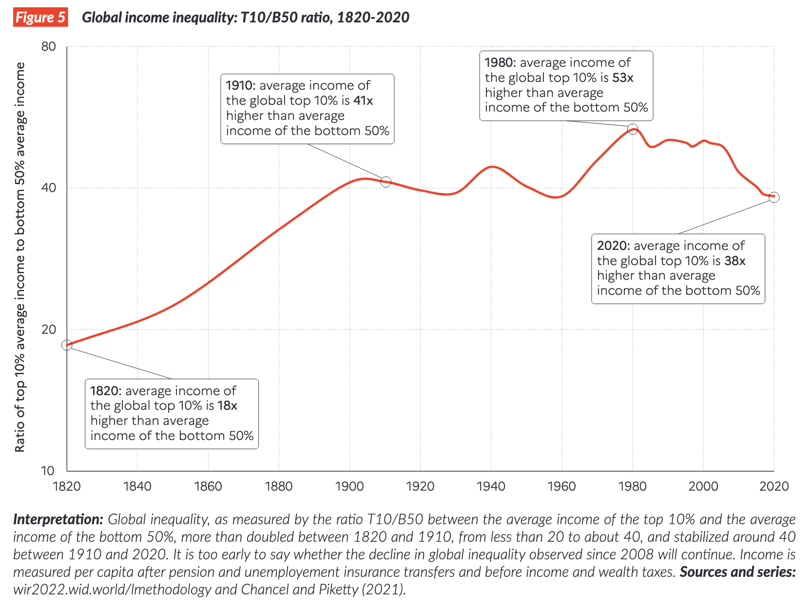
]

---

.left-column[
### The stylized facts on inequality: within vs between country

Chancel et. al. *World Inequality Report* (2022)

+ This is *not* just a story about rich vs poor *countries* 

]

.right-column.center[
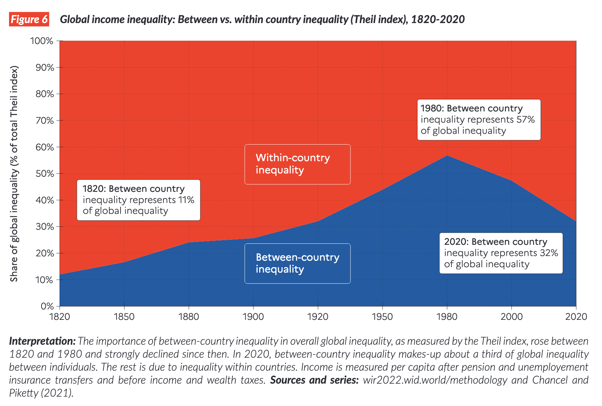
]

---

.left-column[
### Global wealth growth rates: the 'elephant' curve

Chancel et. al. *World Inequality Report* (2022)

+ Globally seems wealthy-nation middle classes may have been squeezed in last 30 years by poor-nation middle classes
]

.right-column.center[
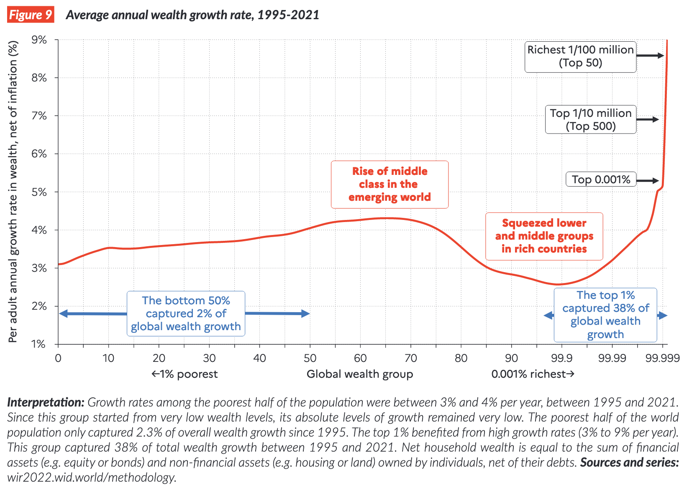
]

---

.left-column[

## US inequality

Saez & Zucman (2020) *Journal of Economic Perspectives*

+ U-pattern across the 20th century based on national accounts data

]

.right-column.center[

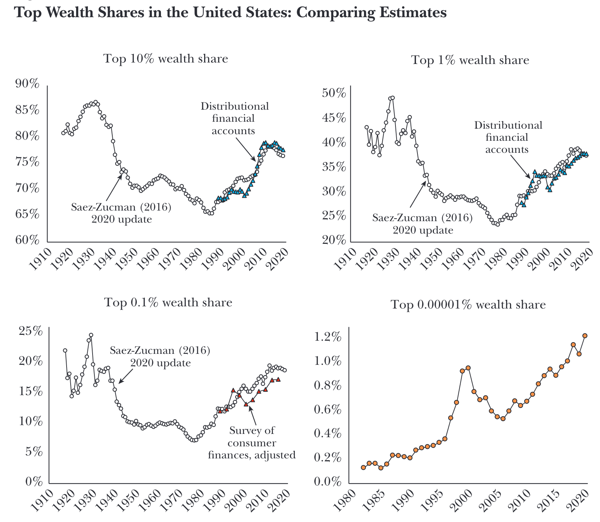
]

---

## The much-debated search for causes

.pull-left[
#### Technology

+ "winner-takes-all" technologies

#### Politics

+ Rent-seeking/de-regulation/dismantling unions/dismantling anti-trust
]

.pull-right[

#### Globalization

+ Larger markets, bigger returns to scale?


#### Education

+ The widening skills gap? (only really works for income not wealth)
]

.center[
#### The Piketty idea (but recall Schmelzing)?

.Large[
$r > g$ ?
]
]

---

## What are the consequences of this rise in inequality?

.center[
 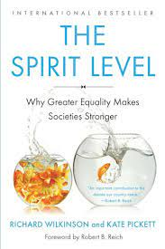 
]

---

## We consider two consequences

.pull-left[

.Large[Inequality and the **real rate of interest**.]

+ Some leading macro-economists, using a new data set, trying to explain the late-20th/early-21st century puzzle of *very low interest rates*.
+ Paper given at an important conference for US policy makers -- possibly significant for policy as well as theory?

]

.pull-right[

.Large[Inequality and the rise in **household debt**.]

+ Really mostly about *housing debt* -- ties inequality to the 2008 financial crisis.
+ But more broadly about debt and financial crises.
+ Points at **leverage externalities**: cases where rational for individuals to take on debt but the risks compound in a way that is collectively bad.
]

.Large.center[Both studies use the same *micro* dataset of households to study *macroeconomic* questions (a good new trend in macro!). Both focused on recent US history (last 70 years).]
---

## Income inequality and $r^*$

.pull-left[

.large[
The object of interest is $r^*$, the 'natural rate of interest'. This is an object defined within economic theory and not directly observable.

$$
r^* = \frac{1}{\sigma} g_c + \theta
$$

+ $\sigma$ inter-temporal elasticity of substitution in consumption
+ $g_c$ growth rate of consumption/pc
+ $\theta$ time preference
]
]

.pull-right[

.center[
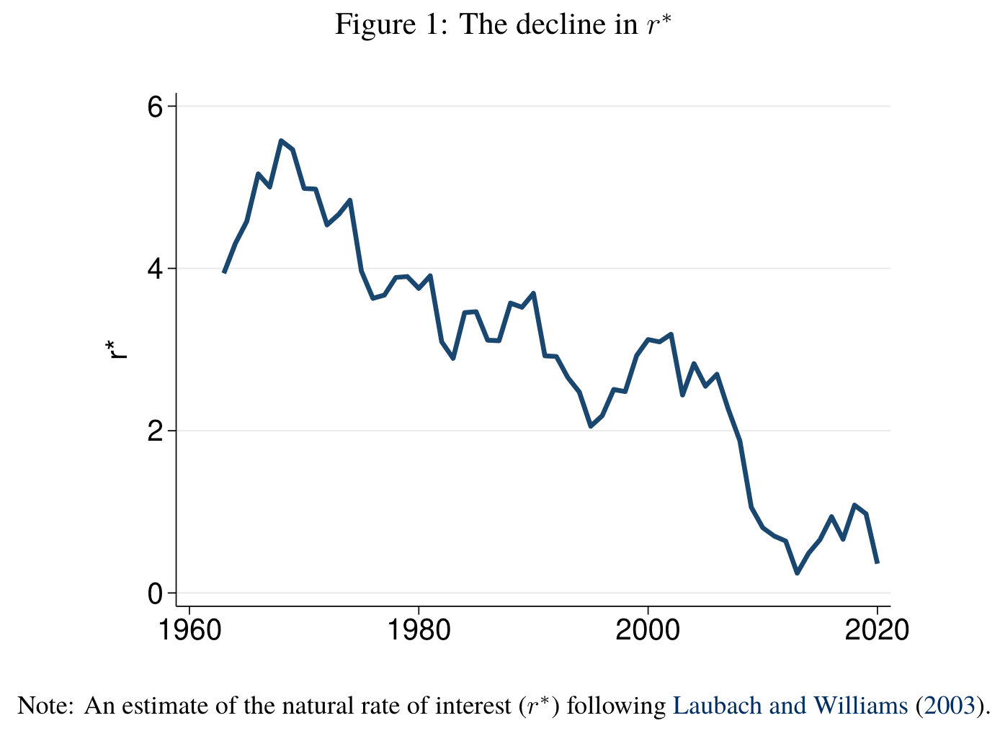
]
]

---

.left-column[
### Is this just a story of declining growth rates?

The growth rate story has been occasionally popular e.g. the lit. on 'secular stagnation' (Gordon, Summers, etc).

But we can also just measure growth rates, so we know the decline in $r^*$ is not mostly a fall in consumption growth.

]

.right-column.center[

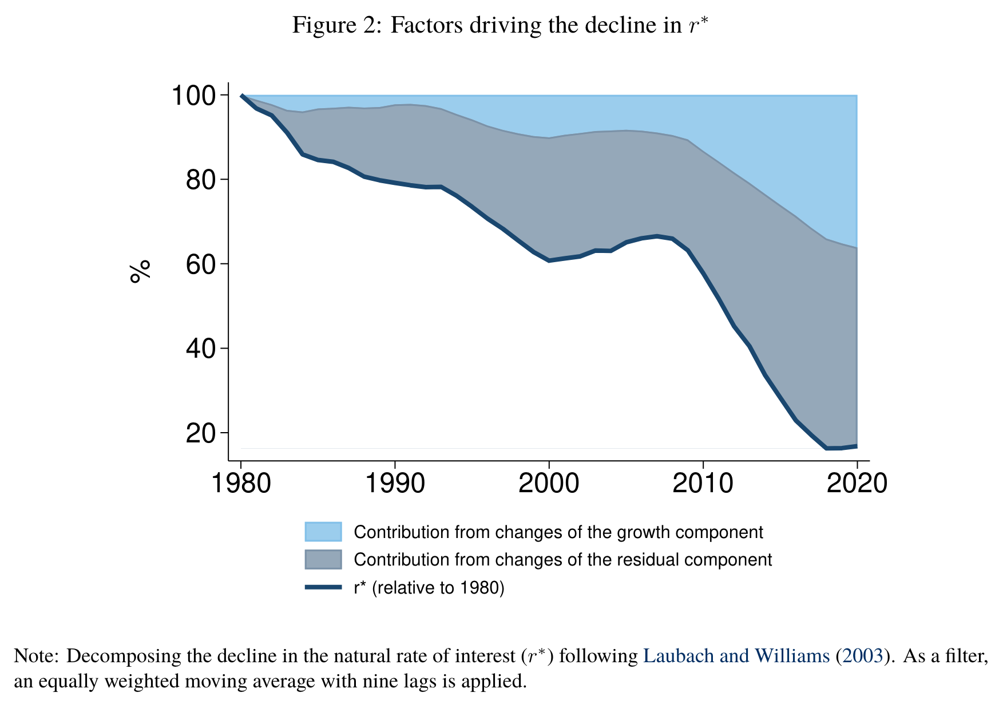
]

---

## What explains this fall? Two theories

.Large[
1. **Inequality**: Mechanism: rich people have higher savings rates. Therefore as inequality has grown rich people have increased the pool of savings. This makes the liquidity preference term fall ( $\theta$ )
2. **Demographics**: As a large cohort of individuals (baby boomers) cycle through life they accumulate savings and then spend it down. The recent fall in $r^*$ is the product of the life-cycle saving behavior of some large-birth cohorts.
  - Also maybe increased longevity
]


---

## How to disentangle?

.Large[
The authors use microeconomic data on US household balance sheets to group households by **cohort** and then compare saving behavior **within cohorts** by income group.

Call $s_{jt}$ the savings rate and call $\alpha_{jt}$ the income share of group $j$ at time $t$. Then total savings from time 0 to $\tau$ can be written as 

$s_{\tau} - s_0 = \sum_{j=1}^{j=J} (\alpha_{j\tau} - \alpha_{j0})s_{j0} +  \sum_{j=1}^{j=J} (s_{j\tau} - s_{j0}) \alpha_{j\tau}$

> "The first term... is the critical object for empirical study. It represents the "all else equal" prediction of what should happen to saving if there is a shift in income toward specific groups over time (p. 8)"

]
---

## If the rich are saving more what has to happen macroeconomically?

.Large[Well... it has to go *somewhere* but not necessarily to investment.

Call $\Theta_{jt}$ the savings amount of group $j$ at time $t$. National accounting identities tell us that

$\Theta_{it} = I_t + F_t - \Theta^g_t - \Theta_{jt}$

where $I_t$ is investment, $F_t$ is the current account, and $\Theta^g_t$ is the government.

In words, if some group saves more it *could* show up in increased investment, or in increased lending abroad, or government could save less, or **some other group could save less**.
]

---

.left-column[
## Findings

+ Find that the effects of saving *within income bracket* are **much larger** than the effects within birth cohort.
+ The rich (top 10%) save much more within all birth cohorts.
]

.right-column.center[
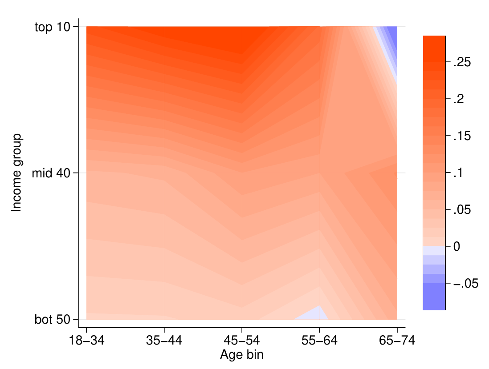
]

---

## Results

.center[
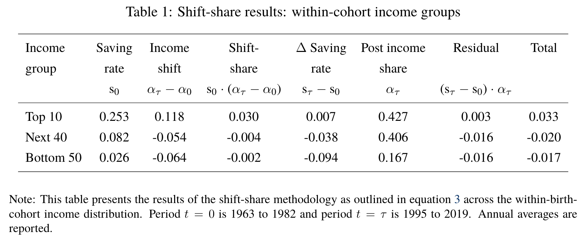
]

---

## Interpretation

.large[
The top 10% are saving 3.3 percentage points more of national income every year than they would have had their income shares remained constant. This represents **37% of annual average private saving**. The bottom 90% have reduced saving substantially.

Actual saving rates have fallen as the bottom 90% reduce their saving to accomodate the top 10%.

#### How are the poor borrowing more?

> "...when there is a rise in income inequality and upward pressure on saving by the rich, investment cannot adjust and $r^∗$ falls. **This boosts the value of asset prices in the economy, loosening borrowing constraints and enabling the non-rich to borrow more from the rich**" (emph. added p. 10)
]


---

## Income inequality and debt


.left-column[
Bartscher et. al. use the same data but want to ask a different question: to what extent have poorer households increased their borrowing in the face of rising income inequality?
]
.right-column.center[
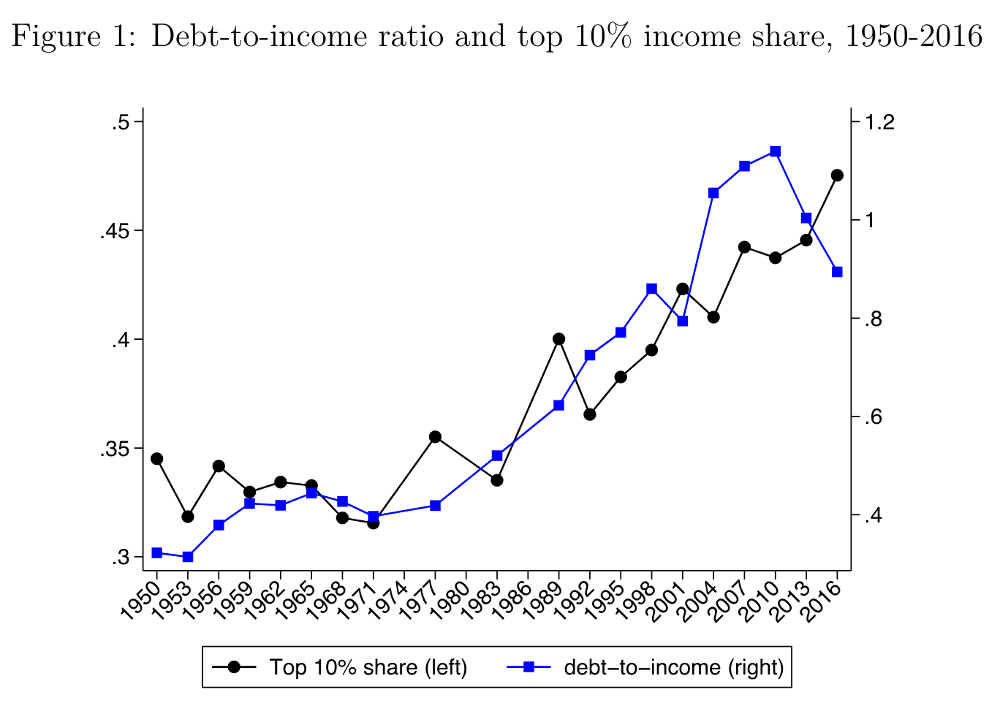
]

---

## The puzzle

.Large[
It makes sense that if you have stagnant income you might want to borrow more to finance your consumption. **But why would someone lend more to you if your income is constant?**

.center[
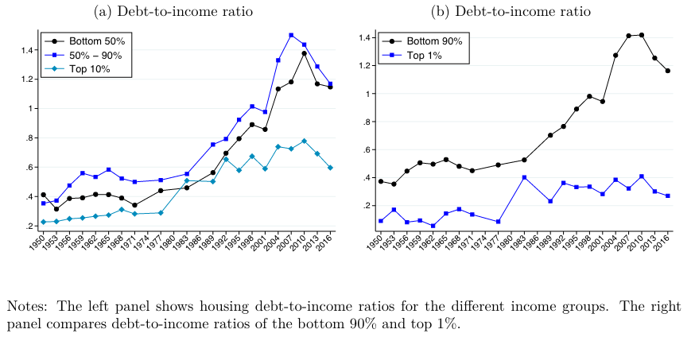]
]

---

## The answer

.Large[**Borrow against your house!**

> "We show that the combined effects of home equity extraction through refinancing, HELOCS, and second mortgages were quantitatively large and explain a substantial share of the incrase in household debt since the 1970s. Debt is key for the response to the wealth shock because **housing is a peculiar asset**. A keyu characteristic is that it is indivisible, meaning it cannot be sold in small increments..." (p. 3).
]

---

## The answer

.center[
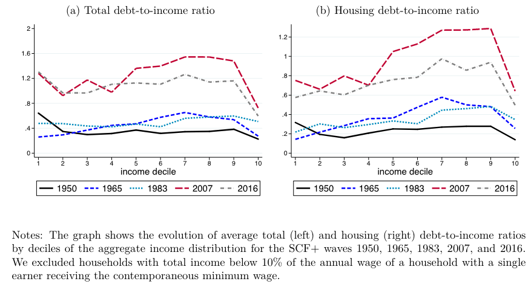]

---

## Interpretation

.Large[
One ramification of the build up in debt is that households are more sensitive to **income shocks** or **asset price declines**.

Borrowing against the growing value of your house to improve your consumption makes perfect sense **if your house will retain its value** and if **you will continue to be able to service the debt**.

Bartscher et. al. connect their work to the idea of "leverage externalities": individually it makes sense to borrow but for the economy as a whole it increases the risk of crises.]

---

## A brief aside on the international dimension

.large[
Bartscher et. al. write: "...this history of household debt in America is compatible with the idea of a savings glut, arising either from global factors (Bernanke 2005) or from growing income concentration at the top (Mian, Straub, and Sufi 2019), which lowered interest rates, loosened borrowing constraints, and increased housing values" (p. 5).
]

.pull-left40.center[

]

.pull-right60[

.large[
Klein and Pettis tie inequality in **trade surplus** countries to the debt build-up in the US. In their account, surpressing lower-class consumption in Germany and China (inequality) requires higher consumption elsewhere (the US) obtained by recycling trade surpluses into the US capital account. **A similar story obtains for petro-state surplus nations. But what happens when the US weaponizes the surpluses?**
]
]
