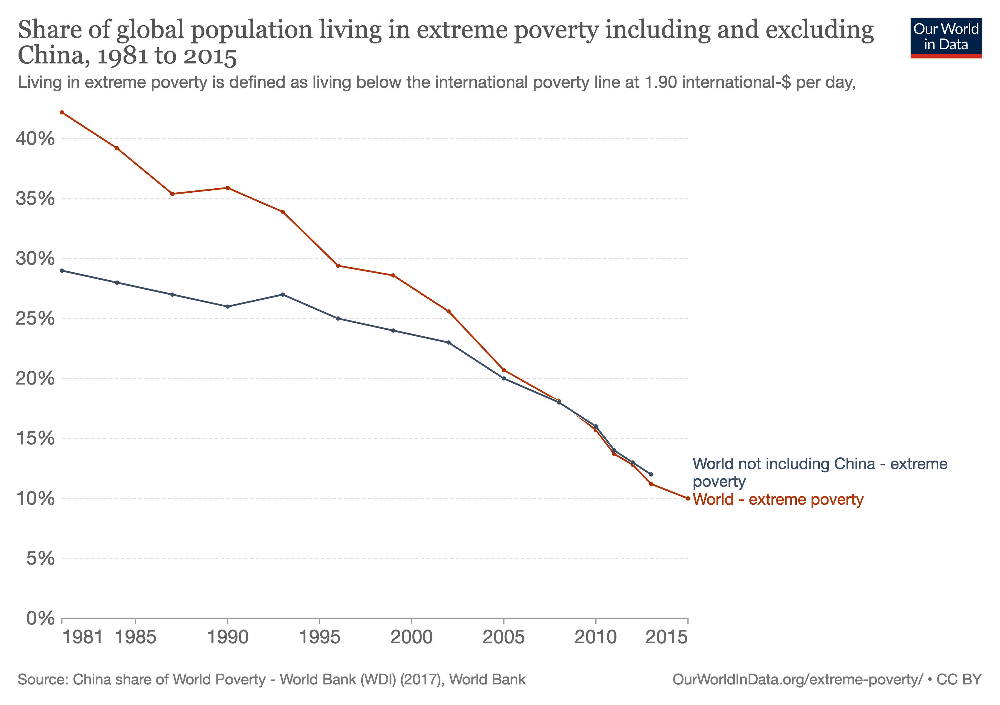
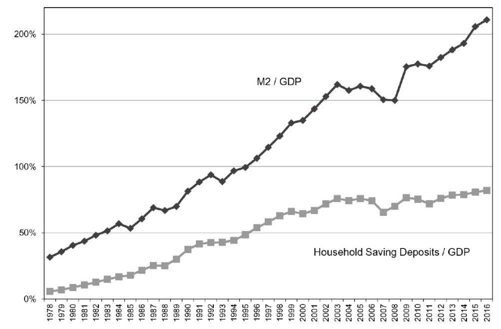
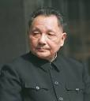
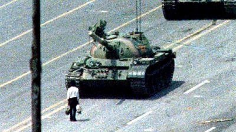
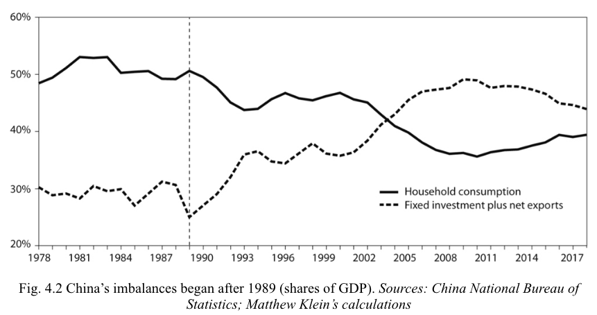
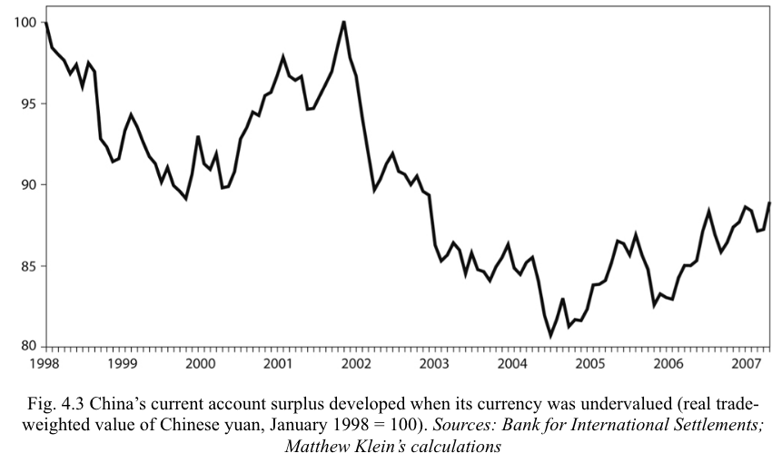
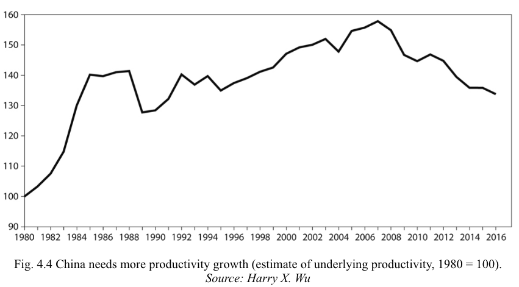
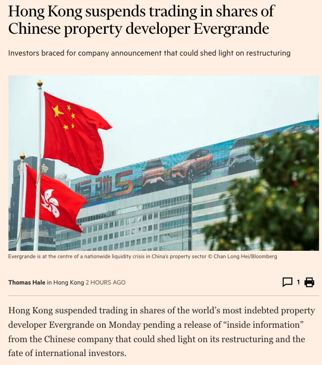
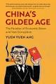

```{r setup, include=FALSE}
knitr::opts_chunk$set(echo = FALSE, warning = FALSE,
                      message = FALSE, fig.align='center', fig.retina=3,
                      out.width="75%")

```

```{r xaringan-themer, include = FALSE}
library(xaringanthemer)
style_solarized_light()
source("helper_functions/theme_lecture.R")
xaringanExtra::use_webcam()
xaringanExtra::use_tile_view()
```


## Introduction

.Large[

### Today's Plan

+ Historical background
+ The Chinese financial system: overview
+ Different patterns of Chinese growth
+ Growth and imbalances
+ Growth and corruption
]

---

.left-column[
## The Chinese Growth Miracle

+ late-20th c. poverty reduction is *hugely* due to Chinese growth
]

.right-column[

]

---

## The Chinese Financial System in Snapshot

.pull-left.Large[
+ The ratio of financial assets to GDP is financial **depth**
  - Usually this grows as GDP/pc grows, since people save more as they get more money
]

.pull-right.Large[
+ The range of financial assets savers can access/borrows can use is called financial **breadth**
  - Financial broadening is common in wealthier countries. Welfare implications can be mixed.
]

.center.Large[The Chinese financial system is **deep** but **narrow**]

---

## The Chinese Financial System in Snapshot

.pull-left[

]

.pull-right[

+ Chinese financial markets are **bank dominated**
+ Characterized by **financial repression**
  - This is good branding by finance. Think 'highly regulated'.
  1. Investment misallocation
  2. Income transfer/consumption suppression
  3. Volatility

.large[**Puzzle**: if the financial system is very repressed and relatively unattractive, why does China have such an exceptionally high savings rate?]
]

---

## Overview of Chinese Economic Growth

.Large[
1. 1950-1977: Maoist policy. Growth is poor
2. 1978 - 1989: Deng Xiaoping program of "reform and opening up": very rapid growth
3.  1990 - 2000ish: Rapid growth by shifting consumption to high savers
4.  2000s - Present: Rapid growth with gdp shortfalls made-up with directed investment
]
---

## Reform and Opening up: 1978-1989

.pull-left.center[

]

.pull-right[

+ By end of 1970s economy in bad state
+ "reform and opening up"
  - Reforms laws preventing unplanned economic activity
  - Shifting planning from center to localities
  - Allow farmers to keep surplus food after selling min. quota to state
  - focus on consumption
  - decentralize credit allocation to local banks (still political)
+ Surge in wealth creation
+ **Why such rapid growth?**
  - Hybrid 'town and village enterprises'
  - "Private entrepreneurship, facilitated by access to capital and microeconomic flexibility, was at the center of China’s takeoff in the 1980s." ([Huang, 2008, p. i](zotero://select/library/items/K94S7KM3)) ([pdf](zotero://open-pdf/library/items/3KRMVMYM?page=3&annotation=DX24G6AS))

]

---

.pull-left[
## Difficulties of reform: 1978-1989


]

.pull-right.large[
Reforms damage vested interests.

Solution is gradualist approach: regulate some prices and let others float. 

For strategic reasons *heavy industry* liberalized more slowly than farming and light manufacturing: creates **rural/urban imbalances**.

Generates rapid food price inflation. Perception of government failure. Urban unrest. Pushback on the process of reform.
]

---

## The Chinese Development Model: 1989 - 2000s

.pull-left[

> “After the repression of 1989, the government shifted from merely seeking to eliminate growth constraints to actively implementing new policies to generate rapid growth. In the absence of political reform, the Communist Party would command popular legitimacy by presiding over remarkable increases in living standards.” ([Klein and Pettis, 2020, p. 116](zotero://select/library/items/MJNZ7BX5)) ([pdf](zotero://open-pdf/library/items/PG9RGBYL?page=116&annotation=IRDADVB3))

+ A very *Gerschenkronian* approach: directed investment
]

.pull-right.large[
A plan for economic growth means focusing on directed investment.

Consequently, you need money to invest which you can obtain with a high-savings rate.

**How do you achieve a high savings rate?**
]

---

.left-column[
## Pushing down household consumption

+ If households consume less savings goes up
+ Can transfer income from households elsewhere to achieve this
]
.right-column[


“Starting in the early 1990s, the Chinese government ... began to implement a variety of mechanisms to **transfer spending power from ordinary Chinese** for the sake of subsidizing domestic investment and foreign consumption. China’s rapid growth helped hide the scale of these transfers from ordinary Chinese workers and retirees.” ([Klein and Pettis, 2020, p. 117](zotero://select/library/items/MJNZ7BX5))
]

---

### Mechanisms for suppressing household consumption: the currency

.pull-left.large[
**Households are essentially importers**, directly or indirectly. 

If you reduce the value of your currency, households cannot purchase as much from abroad. But exporting businesses can sell more. And foreigners can buy more. 

You are transferring income from domestic households to domestic businesses and foreign households.
]

--

.pull-right[
+ Currency depreciation generates large **trade surplus**
+ This should result in large financial outflows from China from private sector, but blocks by govt.
+ In fact, foreigners want to invest in China (undervalued assets)

.large[

1998-2008: **Current account surplus** of roughly $1.4 trillion.

**Private** financial account surplus of $0.5 trillion.

PBOC offsets by accumulating $1.9 trillion of foreign exchange reserves.]
]

---

### Mechanisms for suppressing household consumption: the currency

.center[

]

---

.pull-left40[

### Other mechanisms for suppressing household consumption

> “As of 2018, Chinese households still consume less than 40 percent of Chinese output—a lower ratio than in every other major economy in the world, by far.” ([Klein and Pettis, 2020, p. 120](zotero://select/library/items/MJNZ7BX5)) ([pdf](zotero://open-pdf/library/items/PG9RGBYL?page=120&annotation=FBKIFMJS))


]

.pull-right60.large[

+ Property expropriation
+ Financial repression
  - Can only really have a bank account to save -- interest rates kept low
+ "comparative advantage of lower human rights" (Qin Hui)
  - Adversarial unions banned
  - Labor agitators arrested
  - Prisoners produce manufactured goods
+ *hukou* system:
  - Limit rights to move and settle
  - Not enforced but source of risk
  - Workers taxed but cannot access benefits
+ Hugely regressive tax system: 
  - Income tax ~1% GDP, consumption/social security 14%
]

---

## From High Investment to Over-investment

.Large[
China grew incredibly quickly in the 1990s. It did so in a *Gerschenkronian* way: very high forced savings rate combined with directed investment.

In the 1990s, China was very poor and had weak infrastructure so almost any kind of infrastructure investment had a positive social return. 

At some point, however, this stops being the case...

> “By the late 1990s, however, years of extraordinarily rapid investment growth had made it increasingly difficult to identify obviously productive investments.” ([Klein and Pettis, 2020, p. 124](zotero://select/library/items/MJNZ7BX5)) ([pdf](zotero://open-pdf/library/items/PG9RGBYL?page=124&annotation=LBB52R8I))
]

---

## Is Chinese GDP an input or an output?

.pull-left.large[
$GDP = C + I + G + (X - M)$

But if the target for GDP has been decided (say in a political plan), can make up shortfalls roughly by altering $I$ and $G$.

And in China, $I$ is largely controlled politically.

But... This does not work long-term if investments do not yield returns!
]

.pull-right[

> “China’s provincial and municipal governments control most of the credit creation within the banking system, and Chinese banks rarely have to write down loans for projects that cannot service the debt. **The easiest way for officials to hit their targets is therefore to tell the state-run banks to lend to favored companies to invest in as much infrastructure, manufacturing, and real estate as necessary.**” ([Klein and Pettis, 2020, p. 124](zotero://select/library/items/MJNZ7BX5)) ([pdf](zotero://open-pdf/library/items/PG9RGBYL?page=124&annotation=CDMM8T2Q))

]

---

## Chinese GDP growth vs Chinese productivity growth

.left-column[
+ Subsidies to expand infrastructure and manufacturing capacity very large
+ Hard to identify wasted investment
+ Substantial growth in this 'excess' investment post-2008 when China attempting to make up for falling global demand
]

.right-column.center[

]

---

## How to rebalance?

.large[

China's current account surplus peaked in 2008 at $420 billion and in 2019 has fallen to $190 billion.

But this masks a continued **growing** surplus in manufactured goods. Driven in part by ISI.

ISI very effective despite WTO membership and consequently without use of tariffs. Illustrates the limits of WTO rules in context of heavily state directed economy:

> “In this system, there is little need for tariffs to direct domestic demand toward domestic production. Executives can simply be told to pick Chinese suppliers over foreign ones.” ([Klein and Pettis, 2020, p. 131](zotero://select/library/items/MJNZ7BX5)) ([pdf](zotero://open-pdf/library/items/PG9RGBYL?page=131&annotation=NHIE2RV9))

But there is some real growth in consumption (meat, education, tourism).
]

---

## How to rebalance?

.Large[China needs to reduce total debt burden which is financing unproductive investment. There are two options:]

.pull-left.large[
### Option 1: dropping GDP

Domestic production could fall to meet domestic demand. Aggregate income would fall, probably through wage cuts and unemployment.
]

.pull-right.large[
### Option 2: shift adjustment abroad

Don't let production fall all the way down to domestic demand, instead get foreigners to buy your extra production. Maybe depreciate the yuan?

This is one way to see ISI and Belt and Road Initiative.
]

---

## The way forward?


>“In the end, Beijing must choose among three difficult options: rising debt, rising unemployment, and wealth transfers from elites to ordinary households. To make matters more difficult, it will have to manage these tradeoffs at a time when its trade surplus is under stress, which puts further upward pressure either on debt or on unemployment.” ([Klein and Pettis, 2020, p. 134](zotero://select/library/items/MJNZ7BX5)) ([pdf](zotero://open-pdf/library/items/PG9RGBYL?page=134&annotation=4NGCCKST))


.pull-left.large[

Economy will have to rebalance towards more consumption eventually. Question is how this can be managed.

Cannot continuously hit GDP growth targets above productivity with debt-financed investment if investments are not generating returns.
]

.pull-right.center[


]


---

## State-directed growth and corruption?

.pull-left.large[
China is reported as having high levels of corruption but growth record is spectacular. (Of course in part growth is maybe overstated.) A possible rebuke to political economy?

Ang's answers:

1. Corruption is 'access money'
2. Political system is 'profit sharing'
3. Most damaging corruption curtailed
4. Regional competition
]

.pull-right.center[

]